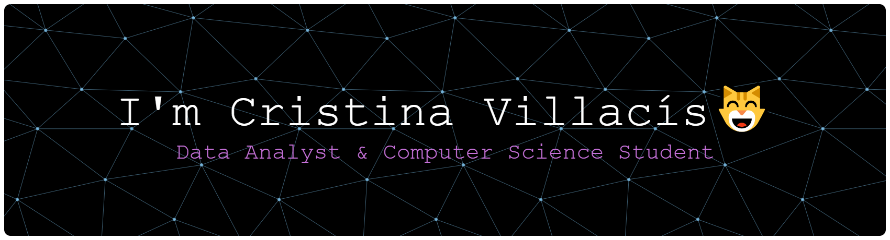

#  Welcome to my GitHub!

  

## Sobre mí🙋‍♀️
Estudiante de **Ingeniería en Ciencias de la Computación** con un enfoque apasionado por el análisis de datos. Mi objetivo es transformar la complejidad técnica en claridad estratégica para potenciar proyectos de alto impacto.

🔭 **Actualmente**: Trabajando en proyectos de análisis de datos y visualización avanzada.

🎓 **Especialización:** Certificado como Data-Driven Decisions Specialist por la `ESPOL`.

⚡ Combino el rigor de la ingeniería con una visión creativa para diseñar narrativas de datos que faciliten la toma de decisiones.

🌍 **Idiomas:** `Inglés` y `Francés` nivel B2.

## Tech Stack 💻

 

### 📂 Proyectos de análisis de datos

| Proyecto | Descripción | Tecnologías | Estado 
| :--- | :--- | :--- | :--- |
| **Retail Business Intelligence** | Este proyecto analizó la operación comercial para identificar patrones de consumo y entender las causas reales de las devoluciones. Resolvió que las pérdidas no eran por fallos técnicos, sino por expectativas del cliente no cumplidas, permitiendo reorientar la estrategia de ventas. |  | `Finalizado` |
| [**Redes de Transporte Urbano**](https://github.com/cristina-villacis/SQL-and-Query-Optimization)| Este proyecto diseñó y normalizó una base de datos relacional para centralizar la gestión de rutas, unidades y horarios de transporte. Se realizó para eliminar la redundancia de información y asegurar la integridad de los datos, permitiendo un control operativo eficiente y escalable de la flota. |  | `Finalizado` |
| **Smart Bank** | Se realizó un análisis de rendimiento de campañas para identificar ventanas de oportunidad y patrones de éxito. El estudio reveló que la insistencia masiva es contraproducente, permitiendo redefinir el modelo operativo hacia una estrategia de precisión: focalización en clientes recurrentes y ejecución táctica en meses clave, eliminando el desperdicio de recursos en contactos improductivos. |    | `Finalizado` |
| **PETROECUADOR** | Se desarrolló una propuesta estratégica de Business Intelligence aplicando técnicas de data storytelling para diagnosticar la crisis de abastecimiento en Petroecuador. El proyecto definió los KPIs críticos y estructuró una narrativa de datos para evidenciar cómo la gestión preventiva podría reducir pérdidas, transformando cifras complejas en planes de acción claros para la toma de decisiones. |  | `Finalizado` |
| **Lumen Analytics: Análisis de comportamiento de compra en retail** | Consultoría de Business Intelligence que unificó datos de ventas físicas y web mediante Python (ETL) y Power BI. El análisis permitió identificar que el crecimiento real depende de productos clave (vinos y carnes) y del nivel educativo del cliente, facilitando el diseño de estrategias de venta cruzada (cross-selling) y mejoras en la experiencia digital (UX) para maximizar las ganancias. |  | `Finalizado` |
| **Análisis de datos para la prevención del abandono y bienestar animal** | Un modelo de análisis de datos para detectar tendencias estacionales y zonas críticas de abandono animal. El proyecto busca transformar datos de rescates en herramientas de decisión para fundaciones, mejorando la eficiencia operativa y las tasas de reubicación. |    | `En curso` |

### 📂 Proyectos de desarrollo web
| Proyecto | Descripción | Tecnologías | Estado 
| :--- | :--- | :--- | :--- |
| [**Upload-form (Formulario)**](https://github.com/cristina-villacis/Upload-form) | Interfaz de gestión de carga de archivos desarrollada con HTML5 y CSS3 que integra una zona de drag and drop y control de documentos mediante Flexbox. El componente destaca por el uso de barras de progreso dinámicas, micro-interacciones en botones y una estructura visual que categoriza archivos por formato (PDF/Excel), optimizando la experiencia del usuario (UX) en procesos de subida de información. | | `Finalizado` |
| **Rediseño de la Interfaz CNEL** | Proyecto orientado a transformar la aplicación de servicios eléctricos en una plataforma intuitiva y fácil de usar. El desarrollo se centra en resolver la navegación compleja de la versión original, priorizando la accesibilidad y una mejor experiencia de usuario (UX) para facilitar gestiones críticas como el pago de planillas y reportes de daños.|  |`En curso` |

### 📊 Mi actividad en GitHub

  
  

---

  

#  ¡Gracias por visitar!✨